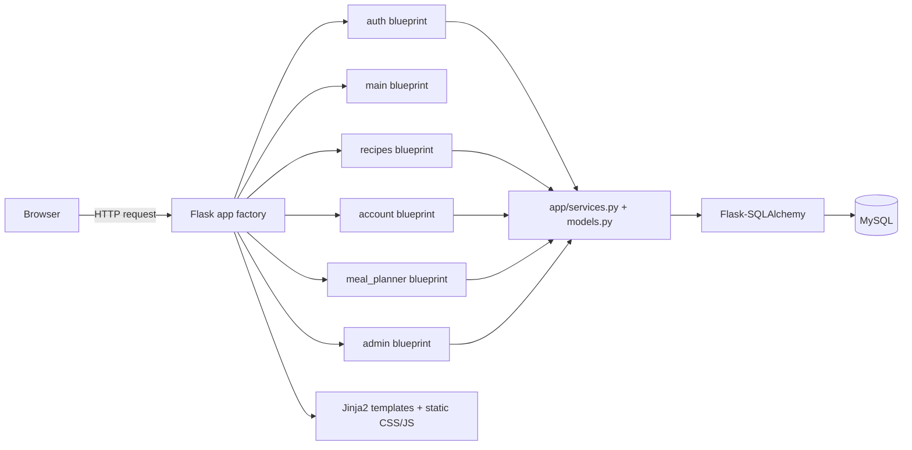
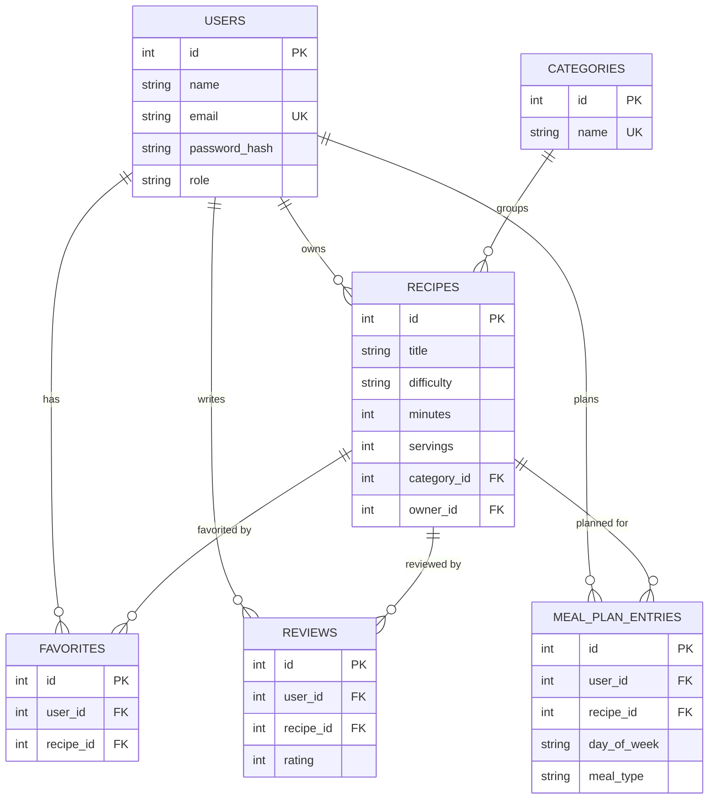

# Recipe Garden - Coursework Report

**Module:** RTW504CA1 - The Internet and Web Technologies
**GitHub Repository:** https://github.com/jeshmin-dot/Food-recipes
**Video Demonstration:** *[add your unlisted YouTube / Google Drive link here before submission]*

---

## Project Overview

Recipe Garden is a full-featured Flask web application for browsing, saving,
and planning meals around recipes. Visitors can search and filter recipes by
cuisine, difficulty, cooking time, and ingredient. Registered users can add
their own recipes with an uploaded image, favorite recipes, leave star
ratings and written reviews, build a weekly meal plan, and generate a
shopping list from that plan automatically. An admin role can manage users,
recipes, and reviews from a dedicated panel. The project was built
incrementally, commit by commit, as a learning exercise in combining a
Flask backend with server-rendered Jinja2 templates and session-based
authentication.

## Technologies Used

The frontend is built with Jinja2 templates, hand-written CSS (a single
`style.css`, no framework), and a small amount of vanilla JavaScript for
progressive-enhancement touches (dark mode toggle, mobile navigation,
sticky navbar, back-to-top button). The backend is Flask, using
Flask-SQLAlchemy as the ORM layer over MySQL for persistence. Passwords are
hashed with Werkzeug's `generate_password_hash`/`check_password_hash`
(scrypt by default). Configuration (secret key, database credentials) is
read from environment variables via `python-dotenv`, keeping secrets out of
source control. The automated test suite uses `pytest` with Flask's test
client. Version control is Git, hosted on GitHub.

## Design and Architecture

The application follows an application-factory pattern (`create_app()` in
`app/__init__.py`) and is organised into Flask blueprints by feature area,
rather than one large file of routes:

```
auth        - login, register, logout, forgot-password
main        - home page, cook mode, pantry preferences
recipes     - browse/search, recipe detail, add/edit/delete, favorites, reviews
account     - profile, account settings, favorites list
meal_planner - weekly planner, shopping list
admin       - user/recipe/review management
```

Shared logic that more than one blueprint needs (recipe lookups, image
upload handling, form validation) lives in `app/services.py`; access-control
and rate-limiting decorators live in `app/decorators.py`. This keeps each
blueprint file focused on HTTP concerns (parsing the request, calling a
service, choosing a template) and makes it straightforward to find where a
given feature lives.



The layout is responsive (a mobile navigation menu replaces the desktop
navbar below a breakpoint), uses a consistent green colour palette and a
single typeface, and includes dark mode saved via a browser cookie.

## Database Design and Backend Logic

Persistence uses six related tables: `users`, `categories`, `recipes`,
`favorites`, `reviews`, and `meal_plan_entries`. Recipes belong to a
category and, optionally, an owning user (kept nullable so a recipe can
survive its author's account being deleted). Favorites and reviews link a
user to a recipe, each with a uniqueness constraint - one favorite and one
review per user per recipe - to keep `Recipe.average_rating` honest instead
of letting a single user stack duplicate reviews. Meal plan entries are
unique per `(user, day_of_week, meal_type)`, so a slot always maps to at
most one recipe.



Filtering and search (`/recipes?q=...&cuisine=...&time=...`) are done as
SQL `WHERE` clauses through SQLAlchemy - `ilike` for text search, `between`
for time buckets - rather than fetching every row and filtering in Python,
so the query stays efficient as the recipe count grows. Every write path
(add/edit/delete recipe, favorite, review, meal plan) wraps its commit in a
`try/except SQLAlchemyError` with an explicit rollback, so a failed write
never leaves a half-committed session for the next request.

## Security Measures

Every POST request is checked against a per-session CSRF token
(`secrets.token_urlsafe`, compared with `secrets.compare_digest` to avoid
timing side-channels) before any handler runs. Passwords are never stored
or logged in plaintext; the minimum length (6 characters) is enforced
server-side in the register/change-password handlers, not just via the
HTML `minlength` attribute, which is trivially bypassed with a raw POST.
Session cookies are `HttpOnly`, `SameSite=Lax`, and `Secure` outside debug
mode. Access control is role-based: `login_required` and `admin_required`
decorators guard every account/recipe-ownership/admin route, and recipe
edit/delete additionally checks that the requester is either the recipe's
owner or an admin. File uploads are validated by extension allowlist and a
5&nbsp;MB size cap, then saved under a randomly generated UUID filename
(via `werkzeug.secure_filename` plus `uuid4`) so a malicious filename can
never be used for a path-traversal or overwrite attack. `/login` and
`/register` are rate-limited (max attempts per IP per time window) to slow
down credential-stuffing and enumeration attempts.

## Version Control Summary

The project was built through roughly thirty incremental commits, each
scoped to one feature or fix (for example: adding the meal planner and
shopping list, hardening session cookie settings, adding the automated
test suite, and this coursework pass adding MySQL persistence, blueprint
modularisation, and additional security hardening). `.gitignore` excludes
the local SQLite/MySQL credentials, the `.env` file, `__pycache__`, and
user-uploaded images, so nothing environment-specific or secret is
committed.

## Challenges Faced and Improvements

Splitting one large route file into blueprints meant every `url_for()` call
in twelve templates had to be updated to the new blueprint-qualified
endpoint name - done with a small verification script that cross-checked
every template reference against the registered endpoints, rather than by
hand, to avoid missing one. The in-memory rate limiter is a deliberate
simplification: it works for a single-process deployment but would need to
move to a shared store (Redis, via Flask-Limiter) to work correctly across
multiple worker processes - a clear next step if this were deployed for
real. Similarly, the shopping list currently groups ingredients by exact
text match, so "1 cup rice" and "2 cups rice" are listed separately;
parsing out quantity and unit would be a good follow-up feature.